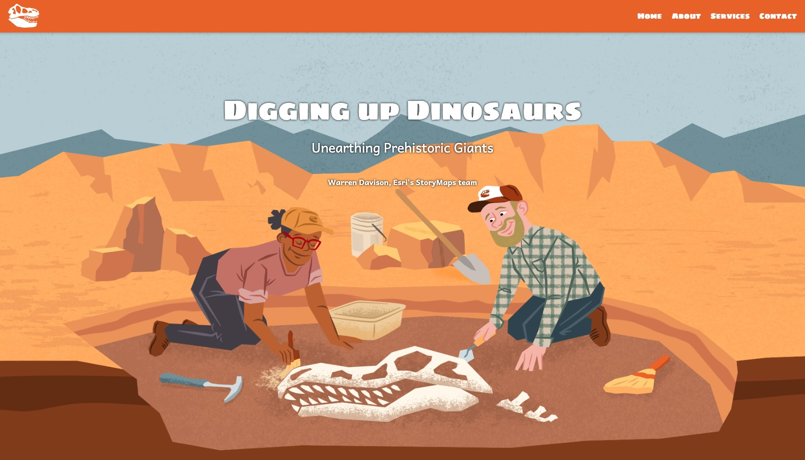

# Custom header and footer

Does your organization employ a custom header and footer for its websites? It's a common approach to ensure a uniform web experience and simplify navigation across pages. By self-hosting your story, you can integrate a custom header and footer around your content, creating a seamless online experience for your audience.

## Live sample

[](https://storymaps.esri.com/stories/embed/header/)_[Click to see the live example](https://esri.github.io/storymaps-developer-samples/embed/header/index.html)_

## Usage instructions

Implementing a customer header and footer involves:

- Creating a header element in your page.
- Creating a footer element in your page.
- Styling these elements.
- Embedding your story within the page.

### HTML customizations

**Header section** The header can contain site navigation or other links as required by your organization.

```html
<!-- Header Section -->
<header>
  <!-- Logo as SVG -->
  <div class="logo">
    <!-- Simple SVG logo (you can replace this with any other SVG code) -->
    <a href="/"></a>
  </div>

  <!-- Navigation Tabs -->
  <nav class="nav-tabs">
    <a href="#home">Home</a>
    <a href="#about">About</a>
    <a href="#services">Services</a>
    <a href="#contact">Contact</a>
  </nav>
</header>
```

**Footer section** This section can contain contact links and various other legal links as required by your organization.

```html
<!-- Footer Section -->
<footer>
  <p>&copy; 2024 Your Company Name. All rights reserved.</p>
  <a href="#privacy-policy">Privacy Policy</a>
  <a href="#terms-of-service">Terms of Service</a>
  <a href="#contact">Contact Us</a>
</footer>
```

### CSS customizations

**Styling the header and footer** The header and footer of your webpage can be styled to align with branding elsewhere on your site.

```css
/* Basic styling for header and footer */
body {
  font-family: "Sigmar";
  margin: 0;
  padding: 0;
}

/* Header Styles */
header {
  background-color: #e46116;
  display: flex;
  align-items: center;
  justify-content: space-between;
  color: white;
  position: sticky;
  top: 0;
  height: 3rem;
  z-index: 1000; /* Ensure it stays on top of other elements */
  box-shadow: 0 2px 5px rgba(0, 0, 0, 0.2); /* Add shadow for better visibility */
  font-family: "Sigmar One";
}

.nav-tabs {
  display: flex;
  gap: 20px;
  margin-right: 10px
}

.nav-tabs a {
  color: white;
  text-decoration: none;
  font-size: 16px;
}

.nav-tabs a:hover {
  text-decoration: underline;
}

/* Footer Styles */
footer {
  background-color: #e46116;
  color: white;
  padding: 20px;
  text-align: center;
}

footer a {
  color: white;
  text-decoration: none;
  margin: 0 15px;
}

a:hover {
  text-decoration: underline;
}
```

### Configure and initialize the Story

Now that you've created an attractive container page, it's time to embed your story.

First, make sure your page includes a StoryMaps root `<div>`—this is where the story will appear.

Second, you'll need to insert two `<script>` tags. The first contains the configuration information required for the embed—namely, the story’s ID and the identifier for the root element. In this case, you’ll also include an additional config parameter: the height of your page’s header. This ensures that certain UI components within the story (like Sidecar blocks) function properly.

```html

  <body>

    <!-- Place this root container where you want the story to appear in the page -->
    <div class="storymaps-root"></div>

    <!-- This is the embed config section. Replace {YOUR-STORY-ID} with the itemID 
        of the you wish to load.  ALSO, this is where you can specify your 
        header's height. -->
    <script>
      window.storyMapsEmbedConfig = {
        storyId: '{YOUR-STORY-ID}',
        rootNode: ".storymaps-root",
        topOffset: "3rem",
      };
    </script>

    <!-- This final script tag loads the StoryMaps presentation engine  -->
    <script
      id="embed-script"
      src="https://storymaps.arcgis.com/embed/view"
    ></script>

  </body>

```

NOTE: Instead of placing the script elements directly in your HTML, you may prefer to keep your JavaScript in a separate .js file—just as we've done in the code files in this folder.